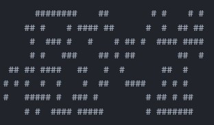
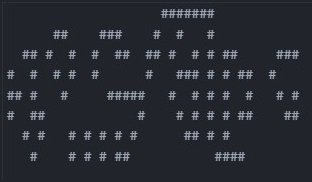
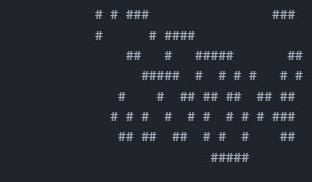

# Лабораторна 1: Розробка термінальної аплікації
## Мета: Розробити аплікацію з термінальним інтерфейсом.

Задача Життя:
Поле M на N вважається заповнене клітинами. Клітини можуть бути у двох станах Живі та Мертві. Перше покоління заповнюється користувачем або випадково. Кожне наступне покоління виводиться з попереднього за правилами:

Якщо в живої клітини два або три сусіди - вона лишається жити;
Якщо в живої клітини один або нуль сусідів - вона помирає від самотності;
Якщо в живої клітини чотири або більше сусідів - вона помирає від перенаселення;
Якщо в мертвої клітини рівно три сусіди - вона оживає.

